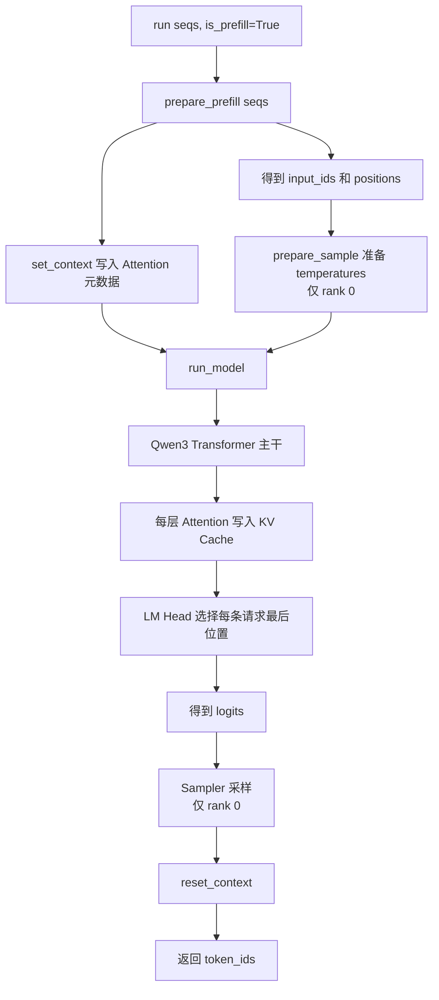
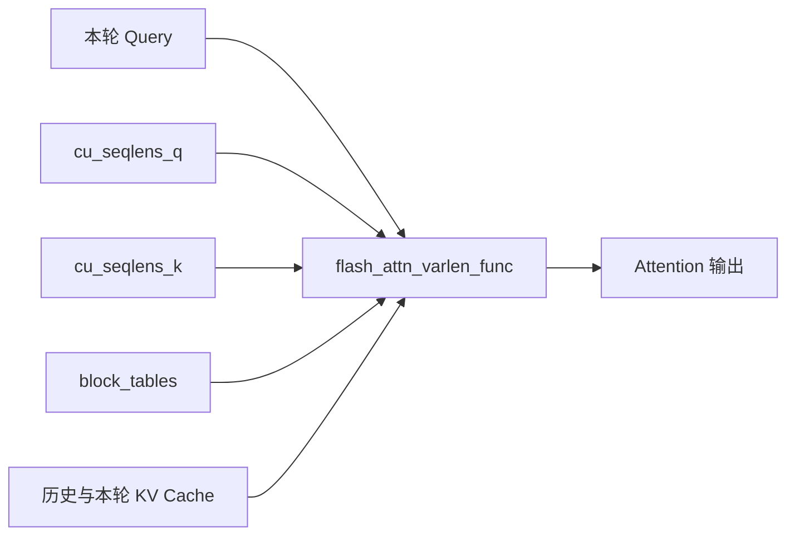

# ModelRunner Prefill 流程画图笔记

对应源码：[nanovllm/engine/model_runner.py](../nanovllm/engine/model_runner.py)

## 1. ModelRunner 在 Prefill 中负责什么

一句话概括：

> ModelRunner 把 Scheduler 选出的多条 Sequence 压平成 GPU 输入，准备 Attention
> 所需的缓存元数据，执行 Qwen3，将 K/V 写入 Cache，并采样第一个输出 token。

```text
Scheduler
选择本轮 Prefill 请求
    │
    │ seqs、num_cached_tokens、num_scheduled_tokens、block_table
    ▼
ModelRunner.prepare_prefill()
    │
    │ input_ids、positions、Context
    ▼
Qwen3 + Attention
    │
    │ hidden_states、KV Cache
    ▼
LM Head
    │
    │ logits
    ▼
Sampler
    │
    │ token_ids
    ▼
Scheduler.postprocess()
```

## 2. Prefill 入口

`LLMEngine.step()` 调用：

```python
token_ids = self.model_runner.call("run", seqs, is_prefill)
```

当：

```python
is_prefill is True
```

`ModelRunner.run()` 的执行路线为：



Prefill 总是走 eager 路径：

```python
if is_prefill or self.enforce_eager or input_ids.size(0) > 512:
    return self.model.compute_logits(self.model(input_ids, positions))
```

即使 `enforce_eager=False`，Prefill 也不会使用 CUDA Graph；CUDA Graph 主要优化
输入 shape 更稳定的 Decode。

## 3. Scheduler 交给 ModelRunner 的数据

进入 `prepare_prefill()` 前，Scheduler 已经为每条 Sequence 设置：

| 字段 | 含义 |
| --- | --- |
| `num_tokens` | 当前 Sequence 的 token 总数 |
| `num_cached_tokens` | 已经计算并写入 KV Cache 的 token 数 |
| `num_scheduled_tokens` | 本轮 Prefill 需要计算的 token 数 |
| `block_table` | 逻辑块到物理 KV Cache block 的映射 |

本轮模型输入区间：

```text
start = num_cached_tokens
end   = start + num_scheduled_tokens

模型输入 = seq[start:end]
```

图示：

```text
token 下标：

0                         start                         end                N
├─────────────────────────┼─────────────────────────────┼──────────────────┤
│ 已位于 KV Cache          │ 本轮 Prefill                │ 以后调度          │
└─────────────────────────┴─────────────────────────────┴──────────────────┘
```

## 4. 贯穿全文的双请求例子

为了展示普通 Prefill 和 Prefix Cache，假设：

```text
block_size = 4
```

这里把块缩小到 4 只是为了方便手算；项目配置中的实际默认值是 256。

### 请求 A：全新 Prompt

```text
token_ids = [A0, A1, A2]

num_tokens           = 3
num_cached_tokens    = 0
num_scheduled_tokens = 3
block_table          = [2]
```

```text
逻辑 token：  [A0 A1 A2]
                   │
                   ▼
物理 block 2：[A0 A1 A2 空]
```

### 请求 B：已有一个完整前缀块

```text
token_ids = [B0, B1, B2, B3, B4, B5]

num_tokens           = 6
num_cached_tokens    = 4
num_scheduled_tokens = 2
block_table          = [5, 9]
```

```text
逻辑 block 0          逻辑 block 1
┌──────────────────┐  ┌──────────────────┐
│ B0 B1 B2 B3      │  │ B4 B5           │
│ 已缓存            │  │ 本轮 Prefill     │
└────────┬─────────┘  └────────┬─────────┘
         │                     │
         ▼                     ▼
    物理 block 5          物理 block 9
```

## 5. 第一步：计算每条请求的输入区间

源码：

```python
start = seq.num_cached_tokens
seqlen_q = seq.num_scheduled_tokens
end = start + seqlen_q
seqlen_k = end
```

请求 A：

```text
start    = 0
seqlen_q = 3
end      = 3
seqlen_k = 3

输入 = seq[0:3] = [A0, A1, A2]
```

请求 B：

```text
start    = 4
seqlen_q = 2
end      = 6
seqlen_k = 6

输入 = seq[4:6] = [B4, B5]
```

`seqlen_q` 和 `seqlen_k` 的区别：

```text
Q 长度 = 本轮真正计算的新 token 数
K 长度 = 历史缓存 + 本轮 token 的完整可见上下文长度
```

对请求 B：

```text
Q：[B4, B5]                         长度 2
K：[B0, B1, B2, B3, B4, B5]         长度 6
```

## 6. 第二步：压平 `input_ids` 和 `positions`

不同请求长度不同，Nano-vLLM 不补 padding，而是直接拼接：

```text
请求 A 输入：[A0, A1, A2]
请求 B 输入：[B4, B5]

                     压平
                      ▼

input_ids = [A0, A1, A2, B4, B5]
```

`positions` 是 token 在自己原序列中的位置：

```text
请求 A positions：[0, 1, 2]
请求 B positions：[4, 5]

positions = [0, 1, 2, 4, 5]
```

对应关系：

```text
input_ids： [A0, A1, A2, B4, B5]
positions： [ 0,  1,  2,  4,  5]
```

请求 B 的位置从 4 开始，因为前四个 token 虽然没有重新输入，但仍属于它的历史
上下文。Qwen3 的 RoPE 使用这些原序列位置。

## 7. 第三步：构造 `cu_seqlens_q`

压平后，FlashAttention 需要知道不同请求的边界。

```text
请求 A 的 Q 长度 = 3
请求 B 的 Q 长度 = 2
```

累加得到：

```text
cu_seqlens_q = [0, 3, 5]
```

图示：

```text
扁平下标：    0    1    2    3    4
             ┌────┬────┬────┬────┬────┐
input_ids    │ A0 │ A1 │ A2 │ B4 │ B5 │
             └────┴────┴────┴────┴────┘
              ▲              ▲         ▲
              0              3         5

cu_seqlens_q = [0, 3, 5]

请求 A = input_ids[0:3]
请求 B = input_ids[3:5]
```

## 8. 第四步：构造 `cu_seqlens_k`

每条请求的 K 长度等于 `end`：

```text
请求 A 的 K 长度 = 3
请求 B 的 K 长度 = 6
```

累加得到：

```text
cu_seqlens_k = [0, 3, 9]
```

注意最后一个值不是实际 `input_ids` 长度，而是各请求完整 K 上下文长度之和：

```text
3 + 6 = 9
```

对比：

```text
cu_seqlens_q[-1] = 5   本轮新计算 5 个 token
cu_seqlens_k[-1] = 9   Attention 总共可见 9 个 K/V token
```

同时得到：

```text
max_seqlen_q = 3
max_seqlen_k = 6
```

FlashAttention 使用它们选择 kernel 参数和工作空间。

## 9. 第五步：构造 `slot_mapping`

`slot_mapping` 与 `input_ids` 一一对应，告诉每层 Attention：

> 当前 token 的 K/V 应写入哪一个物理 Cache slot？

公式：

```text
物理 slot = physical_block_id × block_size + block 内 offset
```

### 请求 A

```text
block_table = [2]
block_size  = 4

A0 → 2 × 4 + 0 = 8
A1 → 2 × 4 + 1 = 9
A2 → 2 × 4 + 2 = 10
```

### 请求 B

前四个 token 已在物理 block 5，本轮只写 `B4、B5`：

```text
block_table = [5, 9]

B4 → 9 × 4 + 0 = 36
B5 → 9 × 4 + 1 = 37
```

最终：

```text
input_ids    = [A0, A1, A2, B4, B5]
slot_mapping = [ 8,  9, 10, 36, 37]
```

写入关系：

```text
A0 的 K/V ─────────▶ slot 8
A1 的 K/V ─────────▶ slot 9
A2 的 K/V ─────────▶ slot 10
B4 的 K/V ─────────▶ slot 36
B5 的 K/V ─────────▶ slot 37
```

每层 Attention 都有独立的 K/V Tensor，但所有层使用相同的 block ID 和 token
offset，因此 `slot_mapping` 可以被每一层复用。

## 10. 第六步：准备 `block_tables`

请求的 Python block table：

```text
A.block_table = [2]
B.block_table = [5, 9]
```

为了组成矩形 Tensor，短表使用 `-1` 补齐：

```text
block_tables =

┌────┬────┐
│  2 │ -1 │  请求 A
├────┼────┤
│  5 │  9 │  请求 B
└────┴────┘
```

代码通过下面的条件判断是否需要它：

```python
if cu_seqlens_k[-1] > cu_seqlens_q[-1]:
    block_tables = self.prepare_block_tables(seqs)
```

当前例子：

```text
9 > 5
```

说明至少一条请求有历史 K/V，所以 Attention 必须通过 block table 读取 Cache。

如果所有请求都是 Fresh Prefill：

```text
cu_seqlens_k[-1] == cu_seqlens_q[-1]
block_tables = None
```

这时 Attention 可以直接使用本轮局部计算出的 K/V，不过仍会根据 `slot_mapping`
把它们写入 Cache，供后续 Decode 使用。

## 11. 第七步：设置全局 Context

列表转换成 GPU Tensor 后，ModelRunner 调用：

```python
set_context(
    True,
    cu_seqlens_q,
    cu_seqlens_k,
    max_seqlen_q,
    max_seqlen_k,
    slot_mapping,
    None,
    block_tables,
)
```

Context 内容：

```text
is_prefill     = True
cu_seqlens_q   = [0, 3, 5]
cu_seqlens_k   = [0, 3, 9]
max_seqlen_q   = 3
max_seqlen_k   = 6
slot_mapping   = [8, 9, 10, 36, 37]
context_lens   = None
block_tables   = [[2, -1], [5, 9]]
```

传递路线：

```text
ModelRunner.set_context()
          │
          ├────────▶ Decoder Layer 0 Attention.get_context()
          ├────────▶ Decoder Layer 1 Attention.get_context()
          ├────────▶ Decoder Layer 2 Attention.get_context()
          └────────▶ ...
```

这样 Qwen3 的每一层不需要显式接收大量调度参数，只需传递：

```text
input_ids、positions、hidden_states
```

## 12. 第八步：执行 Qwen3

```text
input_ids = [A0, A1, A2, B4, B5]
positions = [ 0,  1,  2,  4,  5]
                       │
                       ▼
                 Token Embedding
                       │
                       ▼
          ┌─────────────────────────┐
          │ Qwen3 Decoder Layer × N │
          │                         │
          │ RMSNorm                 │
          │ QKV Projection          │
          │ Q/K Norm + RoPE         │
          │ Attention + KV Cache    │
          │ Output Projection       │
          │ RMSNorm + MLP           │
          └─────────────────────────┘
                       │
                       ▼
                  Final RMSNorm
                       │
                       ▼
hidden_states shape = [5, hidden_size]
```

## 13. Attention 内部发生什么

每一层 Attention 读取 Context：

```python
context = get_context()
```

首先写入本轮 K/V：

```text
当前层新产生的 K/V
        │
        │ slot_mapping
        ▼
当前层的物理 KV Cache
```

然后执行 Prefill FlashAttention：



当前例子中：

```text
请求 A：
Q = [A0, A1, A2]
K/V = [A0, A1, A2]

请求 B：
Q = [B4, B5]
K/V = [B0, B1, B2, B3, B4, B5]
```

因果遮罩保证每个 token 不能看到自己之后的 token。

## 14. 第九步：LM Head 只选择最后位置

Qwen3 主干产生五个隐藏状态：

```text
[A0_hidden, A1_hidden, A2_hidden, B4_hidden, B5_hidden]
```

Prefill 只需要预测每条请求的下一个 token：

```python
last_indices = cu_seqlens_q[1:] - 1
```

代入：

```text
cu_seqlens_q = [0, 3, 5]
last_indices = [2, 4]
```

选择：

```text
下标 2 → A2_hidden
下标 4 → B5_hidden
```

再经过 LM Head：

```text
[2, hidden_size]
        │
        ▼
Parallel LM Head
        │
        ▼
logits shape = [2, vocab_size]
```

## 15. 第十步：rank 0 采样

每条请求的温度组成：

```text
temperatures = [A.temperature, B.temperature]
```

Sampler 将 logits 转为概率并采样：

```text
请求 A logits ─────────▶ G0
请求 B logits ─────────▶ H0
```

返回：

```python
token_ids = [G0, H0]
```

张量并行时，其他 rank 参与模型计算和 collective，但完整词表 logits 最终只汇总
到 rank 0，因此只有 rank 0 执行采样。

## 16. 第十一步：Scheduler 更新 Sequence

ModelRunner 返回后，`Scheduler.postprocess()` 首先登记刚填满的 Prefix Cache，
然后执行：

```text
C = C + S
S = 0
```

### 请求 A

```text
执行前：N=3, C=0, S=3
确认缓存：N=3, C=3, S=0
追加 G0：N=4, C=3, S=0
```

```text
┌───────────────────────────┬──────────┐
│ A0      A1      A2        │ G0       │
│ 已进入 KV Cache            │ 尚未缓存  │
└───────────────────────────┴──────────┘
```

### 请求 B

```text
执行前：N=6, C=4, S=2
确认缓存：N=6, C=6, S=0
追加 H0：N=7, C=6, S=0
```

```text
┌─────────────────────────────────────────────┬──────────┐
│ B0 B1 B2 B3 B4 B5                          │ H0       │
│ 已进入 KV Cache                              │ 尚未缓存  │
└─────────────────────────────────────────────┴──────────┘
```

`G0/H0` 是刚采样结果，还没有作为模型输入，所以它们要在下一轮 Decode 才写入
KV Cache。

## 17. Chunked Prefill 的特殊情况

假设 Prompt 长度为 10，本轮只调度前 4 个 token：

```text
N = 10, C = 0, S = 4
```

ModelRunner 仍会完成：

```text
计算 4 个 token
    ↓
写入它们的 K/V
    ↓
计算该 chunk 最后位置的 logits
    ↓
临时采样一个 token
```

但 Scheduler 更新后发现：

```text
C = 4 < N = 10
```

于是执行：

```python
if is_prefill and seq.num_cached_tokens < seq.num_tokens:
    continue
```

这个临时采样 token 不会追加到 Sequence。只有最后一个 Prompt chunk 完成后，
采样结果才成为真正的第一个 completion token。

## 18. 完整数据流总图

```text
Sequence A                          Sequence B
Fresh Prefill                      Prefix Cache
C=0, S=3                           C=4, S=2
    │                                  │
    └────────────────┬─────────────────┘
                     ▼
            prepare_prefill()
                     │
       ┌─────────────┼───────────────────────────────┐
       │             │                               │
       ▼             ▼                               ▼
 input_ids       positions                       Context
[A0 A1 A2 B4 B5] [0 1 2 4 5]       ┌───────────────────────────┐
                                    │ cu_q  = [0,3,5]            │
                                    │ cu_k  = [0,3,9]            │
                                    │ slot  = [8,9,10,36,37]     │
                                    │ table = [[2,-1],[5,9]]     │
                                    └─────────────┬─────────────┘
                                                  │
       └──────────────────────┬───────────────────┘
                              ▼
                         Qwen3 Forward
                              │
                 ┌────────────┴────────────┐
                 │                         │
                 ▼                         ▼
        新 K/V 写入 Cache          FlashAttention Prefill
                 │                         │
                 └────────────┬────────────┘
                              ▼
                  hidden_states [5, H]
                              │
                    last_indices [2,4]
                              │
                              ▼
                       LM Head [2,V]
                              │
                              ▼
                     Sampler → [G0,H0]
                              │
                              ▼
                 Scheduler.postprocess()
                              │
           ┌──────────────────┴──────────────────┐
           ▼                                     ▼
 A: [A0 A1 A2 G0]                     B: [B0...B5 H0]
    C=3, G0未缓存                         C=6, H0未缓存
```

## 19. 一页速记

```text
ModelRunner Prefill：

1. start = num_cached_tokens
2. end = start + num_scheduled_tokens
3. 多请求 token 压平成 input_ids
4. positions 保留各自在原序列中的位置
5. cu_seqlens_q 记录本轮 Query 边界
6. cu_seqlens_k 记录完整上下文边界
7. slot_mapping 指定新 K/V 的物理写入位置
8. block_tables 指定历史 K/V 所在的物理块
9. Context 把这些元数据提供给每层 Attention
10. Qwen3 执行并写入 KV Cache
11. LM Head 只选择每条请求最后位置
12. rank 0 采样第一个 completion token
13. Scheduler 确认缓存进度并追加 token
```

最核心的四个概念：

```text
input_ids     = 本轮真正需要计算的 token
cu_seqlens    = 压平后如何恢复各请求边界
slot_mapping  = 新 K/V 写到哪里
block_tables  = 历史 K/V 从哪里读取
```
