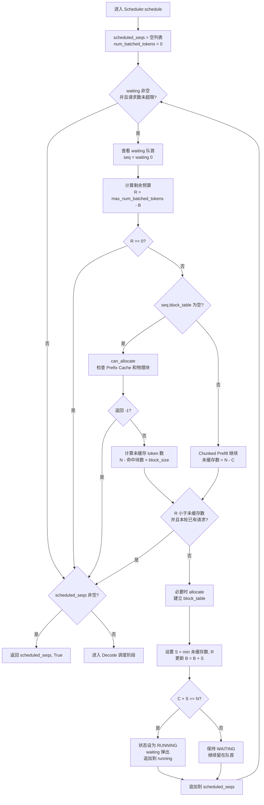

# Scheduler 第一阶段：Prefill 调度画图笔记

对应源码：[nanovllm/engine/scheduler.py](../nanovllm/engine/scheduler.py)

## 1. 这一阶段要做什么

Prefill 调度不负责执行 Qwen3，它只负责制定本轮计划：

```text
waiting 队列
    │
    │ 选择请求、检查 KV Cache、计算 token 预算
    ▼
scheduled_seqs
    │
    │ return scheduled_seqs, True
    ▼
ModelRunner 才真正执行 Prefill
```

返回值中的 `True` 表示：本轮选中的所有 Sequence 都使用 Prefill 路径。

## 2. 先记住五个符号

| 符号 | 对应代码 | 含义 |
| --- | --- | --- |
| `N` | `seq.num_tokens` | Sequence 当前拥有的 token 总数 |
| `C` | `seq.num_cached_tokens` | 已计算并写入 KV Cache 的 token 数 |
| `S` | `seq.num_scheduled_tokens` | 本轮计划计算的 token 数 |
| `R` | `remaining` | 本轮 batch 剩余的 token 预算 |
| `B` | `num_batched_tokens` | 本轮已经调度的 token 总数 |

不考虑 Prefix Cache 时，核心公式是：

```text
尚未缓存的 token 数 = N - C

S = min(N - C, R)
```

本轮调度后的 token 区间：

```text
token 下标：

0                         C                 C + S                         N
├─────────────────────────┼─────────────────┼─────────────────────────────┤
│ 已经位于 KV Cache        │ 本轮计划计算     │ 以后再调度                   │
└─────────────────────────┴─────────────────┴─────────────────────────────┘
```

判断 Prompt 是否已经完整进入本轮计划：

```text
C + S == N  →  WAITING 移到 RUNNING
C + S <  N  →  继续留在 WAITING，后续继续 Chunked Prefill
```

> `C + S == N` 只表示“本轮计划完成后会覆盖整个 Prompt”。此时 GPU 还没有真正
> 执行模型，`num_cached_tokens` 要等 `postprocess()` 才会增加。

## 3. Prefill 调度总流程图



## 4. 普通 Prefill：一次处理完整 Prompt

假设：

```text
Prompt A = [P0, P1, P2, P3]
max_num_batched_tokens = 8
Prefix Cache 命中块数 = 0
```

初始状态：

```text
waiting = [A]
running = []

N = 4
C = 0
S = 0
R = 8
status = WAITING
```

调度计算：

```text
未缓存数 = N - C = 4 - 0 = 4
S = min(4, 8) = 4

C + S = 0 + 4 = 4 = N
```

所以 Scheduler 移动队列：

```text
调度前：

waiting  ┌───┐
────────▶│ A │
         └───┘

running  空


调度后：

waiting  空

running  ┌───┐
────────▶│ A │
         └───┘

scheduled_seqs = [A]
status = RUNNING
```

token 状态：

```text
┌───────────────────────────────┐
│ P0      P1      P2      P3    │
│          本轮 Prefill          │
└───────────────────────────────┘

N = 4, C = 0, S = 4
```

随后 ModelRunner 执行模型，`postprocess()` 才更新为：

```text
N = 4, C = 4, S = 0
```

采样并追加第一个生成 token `G0` 后：

```text
┌───────────────────────────────┬─────────┐
│ P0      P1      P2      P3    │ G0      │
│        已进入 KV Cache         │ 尚未缓存 │
└───────────────────────────────┴─────────┘

N = 5, C = 4, S = 0
status = RUNNING
```

## 5. Chunked Prefill：一次放不下完整 Prompt

假设：

```text
Prompt A 有 10 个 token
max_num_batched_tokens = 4
Prefix Cache 命中块数 = 0
```

### 第一轮

```text
N = 10, C = 0, R = 4
S = min(10 - 0, 4) = 4

C + S = 4 < 10
```

```text
┌───────────────────┬───────────────────────────┐
│ P0 P1 P2 P3       │ P4 P5 P6 P7 P8 P9        │
│ 第一轮 Prefill     │ 尚未调度                   │
└───────────────────┴───────────────────────────┘

调度时：N=10, C=0, S=4, status=WAITING
执行后：N=10, C=4, S=0, status=WAITING
```

### 第二轮

```text
N = 10, C = 4, R = 4
S = min(10 - 4, 4) = 4

C + S = 8 < 10
```

```text
┌───────────────────┬───────────────────┬───────────┐
│ P0 P1 P2 P3       │ P4 P5 P6 P7       │ P8 P9     │
│ 已缓存             │ 第二轮 Prefill     │ 尚未调度   │
└───────────────────┴───────────────────┴───────────┘

调度时：N=10, C=4, S=4, status=WAITING
执行后：N=10, C=8, S=0, status=WAITING
```

### 第三轮

```text
N = 10, C = 8, R = 4
S = min(10 - 8, 4) = 2

C + S = 10 = N
```

```text
┌───────────────────────────────────────┬───────────┐
│ P0 P1 P2 P3 P4 P5 P6 P7              │ P8 P9     │
│ 已缓存                                 │ 本轮调度   │
└───────────────────────────────────────┴───────────┘

调度时：N=10, C=8, S=2, status=RUNNING
```

三轮状态变化：

```text
第 1 轮：WAITING ──部分 Prefill──▶ WAITING
第 2 轮：WAITING ──部分 Prefill──▶ WAITING
第 3 轮：WAITING ──最后一块调度──▶ RUNNING
```

部分 Prefill 的模型输出不会追加到 Sequence。只有完整 Prompt 处理完之后，最后
一个 Prompt token 的 logits 才用于采样第一个 completion token。

## 6. 为什么只有本轮第一条请求可以 Chunked Prefill

关键判断：

```python
if remaining < num_tokens and scheduled_seqs:
    break
```

假设本轮预算为 6：

```text
请求 A 需要 4 个 token
请求 B 需要 5 个 token
```

调度 A 后：

```text
scheduled_seqs = [A]
已使用 B = 4
剩余 R = 2
```

B 需要 5 个，但只剩 2 个预算，而且 `scheduled_seqs` 已经非空：

```text
remaining < num_tokens  →  2 < 5，成立
scheduled_seqs          →  [A]，非空
```

因此本轮停止：

```text
本轮：A 完整 Prefill
下轮：B 再开始 Prefill
```

如果 B 是本轮第一条请求，`scheduled_seqs` 为空，就允许它使用全部剩余预算进行
Chunked Prefill。这个限制使每个 batch 最多只有第一条请求被切分。

## 7. Prefix Cache 命中

为方便画图，假设：

```text
block_size = 4
Prompt 长度 N = 10
前两个完整 block 已命中
```

```text
逻辑 block 0         逻辑 block 1         逻辑 block 2
┌──────────────────┐ ┌──────────────────┐ ┌──────────┐
│ P0 P1 P2 P3      │ │ P4 P5 P6 P7      │ │ P8 P9    │
│ Prefix Cache 命中 │ │ Prefix Cache 命中 │ │ 本轮计算  │
└──────────────────┘ └──────────────────┘ └──────────┘
```

计算：

```text
num_cached_blocks = 2
C = 2 × block_size = 8

未缓存 token 数 = N - C = 10 - 8 = 2
S = min(2, R)
```

如果本轮至少还有 2 个 token 预算：

```text
C + S = 8 + 2 = 10 = N
```

请求直接完整进入本轮 Prefill 调度：

```text
WAITING → RUNNING
```

模型只重新计算 `P8、P9`，前八个 token 的 K/V 从 Prefix Cache 读取。

## 8. 多请求队列变化

假设：

```text
waiting = [A, B, C]
running = [X, Y]
```

本轮 A、B 能完整放入预算，C 放不下：

```text
调度前：

waiting  ──▶ [A] [B] [C]
running  ──▶ [X] [Y]


Prefill 调度后：

waiting  ──▶ [C]
running  ──▶ [X] [Y] [A] [B]
scheduled_seqs = [A, B]
is_prefill = True
```

虽然 running 中已经有 X、Y 等待 Decode，但本轮只要调度到了 A、B 的 Prefill，
`schedule()` 就直接返回，不会把 X、Y 混入本轮。

## 9. 调度与执行不要混淆

```text
Scheduler.schedule()
│
│ 只制定计划：
│ - 设置 num_scheduled_tokens
│ - 分配 block
│ - 移动 waiting/running 队列
│
▼
ModelRunner.run()
│
│ 真正执行：
│ - 准备 input_ids / positions
│ - 执行 Qwen3
│ - 写入 KV Cache
│ - 采样 token
│
▼
Scheduler.postprocess()
│
│ 确认执行结果：
│ - C = C + S
│ - S = 0
│ - 完整 Prefill 时追加采样 token
│ - 检查 EOS / max_tokens
│
▼
进入下一轮 step
```

## 10. 一页速记

```text
Prefill 调度目标：
从 waiting 队首选择请求，在请求数和 token 预算内构造一个 Prefill batch。

核心公式：
S = min(未缓存 token 数, 本轮剩余预算 R)

完整性判断：
C + S == N  → WAITING 移到 RUNNING
C + S <  N  → 保持 WAITING，继续 Chunked Prefill

Prefix Cache：
命中的完整 block 直接计入 C，不需要重新计算。

优先级：
只要本轮选到了 Prefill，就直接返回，不再混入 Decode。

重要区别：
schedule() 只制定计划；run() 才执行 GPU 计算；postprocess() 才确认缓存进度。
```

